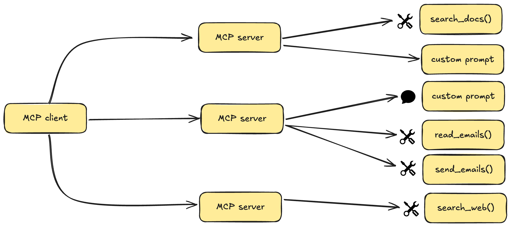

# Ejemplo de Servidor MCP

Este repositorio contiene una implementación de un servidor Model Context Protocol (MCP). 
Este código demuestra cómo construir un servidor MCP funcional que puede integrarse con varios clientes de modelos de lenguaje (LLM).


## ¿Qué es MCP?

MCP (Model Context Protocol) es un protocolo abierto que estandariza la forma en que las aplicaciones proporcionan contexto a los modelos de lenguaje (LLM). MCP actúa como un puerto USB-C para aplicaciones de IA, proporcionando una manera estandarizada de conectar modelos de IA con diferentes fuentes de datos y herramientas.



### Beneficios clave

- Una lista creciente de integraciones preconstruidas que tu LLM puede utilizar directamente.
- Flexibilidad para cambiar entre proveedores y vendedores de LLM.
- Mejores prácticas para proteger tus datos dentro de tu infraestructura.

## Resumen de la Arquitectura

MCP sigue una arquitectura cliente-servidor en la que una aplicación anfitriona puede conectarse a múltiples servidores:

- **Anfitriones MCP**: Programas como Claude Desktop, IDEs o herramientas de IA que quieren acceder a datos a través de MCP.
- **Clientes MCP**: Clientes del protocolo que mantienen conexiones 1:1 con los servidores.
- **Servidores MCP**: Programas ligeros que exponen capacidades específicas a través del Model Context Protocol.
- **Fuentes de Datos**: Tanto locales (archivos, bases de datos) como servicios remotos (APIs) a los que los servidores MCP pueden acceder.

## Conceptos Claves de MCP

Los servidores MCP pueden proporcionar tres tipos principales de capacidades:

- **Recursos**: Datos similares a archivos que pueden ser leídos por los clientes (como respuestas de API o contenidos de archivos).
- **Herramientas**: Funciones que pueden ser llamadas por el LLM (con aprobación del usuario).
- **Prompts**: Plantillas predefinidas que ayudan a los usuarios a completar tareas específicas.

## Requisitos del Sistema

- Python 3.10 o superior
- MCP SDK 1.2.0 o superior
- Administrador de paquetes `uv`

## Comenzando

### Instalación del Administrador de Paquetes uv

En macOS/Linux:

```bash
curl -LsSf https://astral.sh/uv/install.sh | sh
```

En Windows:

```bash
iwr -useb https://astral.sh/uv/install.ps1 | iex
```

Asegúrate de reiniciar tu terminal después de la instalación para que el comando `uv` esté disponible.

### Configuración del Proyecto

1. Crear e inicializar el proyecto:

```bash
# Crear un nuevo directorio para el proyecto
uv init mcp-server
cd mcp-server

# Crear y activar el entorno virtual
uv venv
source .venv/bin/activate  # En Windows: .venv\Scripts\activate

# Instalar dependencias
uv add "mcp[cli]" httpx
```

2. Crear el archivo de implementación del servidor:

```bash
touch main.py
```

### Ejecutando el Servidor

1. Iniciar el servidor MCP:

```bash
uv run main.py
```

2. El servidor estará listo para aceptar conexiones.

## Conectando con Claude Desktop

1. Instalar Claude Desktop desde el sitio oficial.
2. Configurar Claude Desktop para usar tu servidor MCP:

Edita el archivo `~/Library/Application Support/Claude/claude_desktop_config.json`:

```json
{
    "mcpServers": {
        "mcp-server": {
            "command": "uv",
            "args": [
                "--directory",
                "/RUTA/ABSOLUTA/A/TU/mcp-server",
                "run",
                "main.py"
            ]
        }
    }
}
```

3. Reinicia Claude Desktop.

## Solución de Problemas

Si tu servidor no es detectado por Claude Desktop:

1. Verifica la ruta y permisos del archivo de configuración.
2. Asegúrate de que la ruta absoluta en la configuración es correcta.
3. Confirma que `uv` esté instalado y accesible.
4. Revisa los registros de Claude Desktop en busca de errores.

## Licencia

Este proyecto está licenciado bajo la Licencia MIT. Consulta el archivo [LICENSE](LICENSE) para más detalles.
